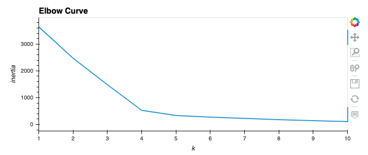
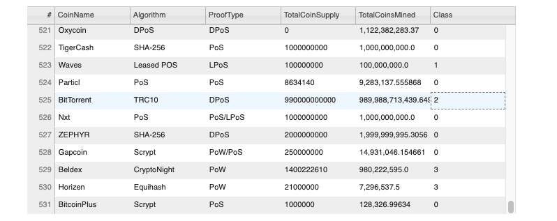
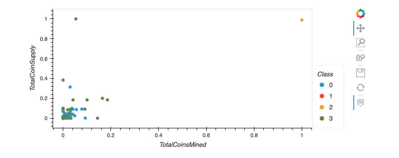

## Project Overview

The purpose of this project is to use unsupervised machine learning to analyze a database of cryptocurrencies and transform the dataset in order to present a report of traded cryptocurrencies by group according to their features (Coin mined, Total Coin Supply, etc).

## Resources

- Dataset: Resources/crypto_data.csv
- Software: Python 3.7.7, Anaconda Navigator 1.9.12, Conda 4.8.4, Jupyter Notebook 6.0.3

## Results

### Clustering Crytocurrencies Using K-Means

Clustering is one of the most common exploratory data analysis technique used to get an intuition about the structure of the data. The elbow curve below was built using the K-Means method that iterate on k values from 1 to 10. The best k value appears to be 4 and this analysis will use 4 clusters.

### Hvplot table with tradable cryptocurrencies.

Most of the cryptocurrencies are part of class #0 and #1, but we only have one (BitTorrent) in class #2.

### 2D-Scatter plot with TotalCoinMined vs TotalCoinSupply

Plotting the scatter plot from two cryptocurrency features directly does not efficiently spread the classes and told us we should use another method to complete our analysis.

## Summary

We have 532 cryptocurrencies that have similarities features.
